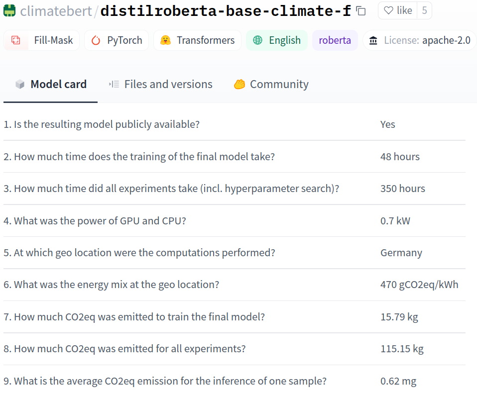
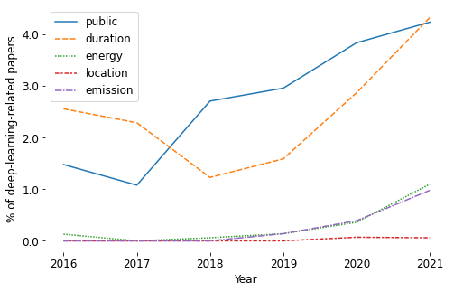

# Towards Climate Awareness in NLP Research
This repository contains the code and model card templates accompanying the paper [Towards Climate Awareness in NLP Research](https://arxiv.org/abs/2205.05071):

```
@misc{hershcovich-etal-2022-towards,
doi = {10.48550/ARXIV.2205.05071},
url = {https://arxiv.org/abs/2205.05071},
author = {Hershcovich, Daniel and Webersinke, Nicolas and
Kraus, Mathias and Bingler, Julia Anna and Leippold, Markus},
title = {Towards Climate Awareness in NLP Research},
publisher = {arXiv},
year = {2022},
copyright = {Creative Commons Attribution 4.0 International}
}
```

## Example Model Card

Here is an example climate performance model card according to the guidelines proposed in this paper. The model is [ClimateBert](https://climatebert.ai/), a language model finetuned on climate-related text. The same information is provided on the [Hugging Face model page](https://huggingface.co/climatebert).

<p align="center">

</p>

## Templates

[model_card_template.tex](model_card_template.tex) is a template that can be used in scientific papers to report the climate performance of models published along with them. The template can be included as part of a *Broader Impact* section. It requires the bibliography entry provided above. Authors are further encouraged to elaborate in the text on the accuracy of the provided information, possible improvements that can be done, and the positive environmental impact expected from their work.

[model_card_template.md](model_card_template.md) is a template that can be used in the model card on Hugging Face, for example, to report the climate performance of the model.

## Survey of Climate Discussion in NLP

In the paper we conduct a survey of 2016-2021 papers from the [ACL Anthology](https://aclanthology.org/).
[Towards_Climate_Awareness.ipynb](Towards_Climate_Awareness.ipynb) is a collaborative notebook with the code used to conduct the survey.
The following figure from the paper visualizes the development of proportions of deep-learning-related *ACL papers discussing *public* model weights, *duration* of model training or optimization, *energy* consumption, *location* where computations where performed, and *emission* of GHG.

<p align="center">

</p>

