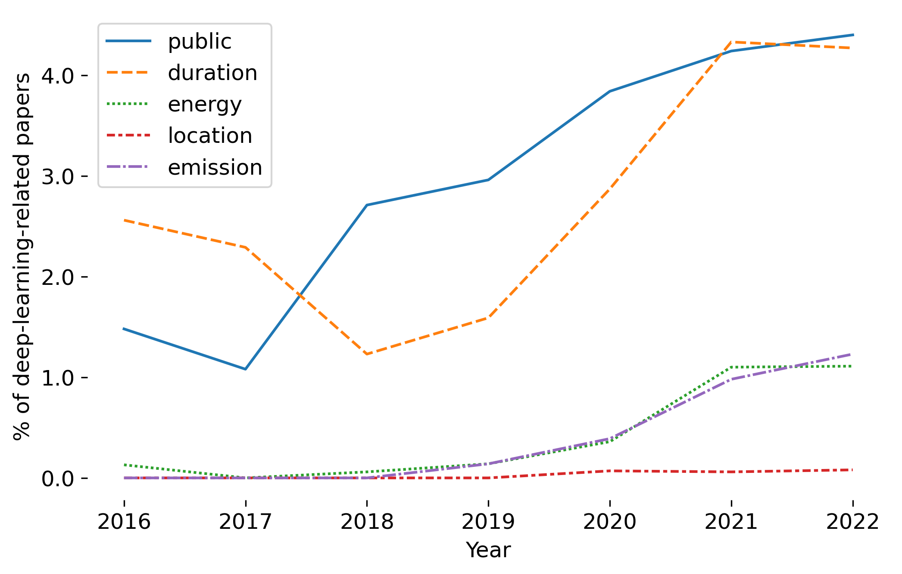

# Towards Climate Awareness in NLP Research
The environmental impact of AI, and particularly Natural Language Processing (NLP), has become significant and is worryingly increasing due to the enormous energy consumption of model training and deployment. Here, we draw on corporate climate reporting standards and proposes a model card for NLP models, aiming to increase reporting relevance, completeness, consistency, transparency, and accuracy.

This repository contains the code and model card templates accompanying the paper [Towards Climate Awareness in NLP Research](https://aclanthology.org/2022.emnlp-main.159/), presented in [EMNLP 2022](https://2022.emnlp.org/):

```
@inproceedings{hershcovich-etal-2022-towards,
    title = "Towards Climate Awareness in {NLP} Research",
    author = "Hershcovich, Daniel  and
      Webersinke, Nicolas  and
      Kraus, Mathias  and
      Bingler, Julia  and
      Leippold, Markus",
    booktitle = "Proceedings of the 2022 Conference on Empirical Methods in Natural Language Processing",
    month = dec,
    year = "2022",
    address = "Abu Dhabi, United Arab Emirates",
    publisher = "Association for Computational Linguistics",
    url = "https://aclanthology.org/2022.emnlp-main.159",
    pages = "2480--2494",
    abstract = "The climate impact of AI, and NLP research in particular, has become a serious issue given the enormous amount of energy that is increasingly being used for training and running computational models. Consequently, increasing focus is placed on efficient NLP. However, this important initiative lacks simple guidelines that would allow for systematic climate reporting of NLP research. We argue that this deficiency is one of the reasons why very few publications in NLP report key figures that would allow a more thorough examination of environmental impact, and present a quantitative survey to demonstrate this. As a remedy, we propose a climate performance model card with the primary purpose of being practically usable with only limited information about experiments and the underlying computer hardware. We describe why this step is essential to increase awareness about the environmental impact of NLP research and, thereby, paving the way for more thorough discussions.",
}
```

## Example Model Cards

The directory [`model_cards`](model_cards/) contains model cards for some commonly used NLP models, including [GPT-3](model_cards/gpt3.md) and [BLOOM](model_cards/bloom.md).

[Here](model_cards/climatebert.md) is an example climate performance model card according to the guidelines proposed in this paper. The model is [ClimateBert](https://climatebert.ai/), a language model finetuned on climate-related text. The same information is provided on the [Hugging Face model page](https://huggingface.co/climatebert).

<p align="center">

</p>

## Templates

[model_card_template.tex](model_card_template.tex) is a template that can be used in scientific papers to report the climate performance of models published along with them. The template can be included as part of a *Broader Impact* section. It requires the bibliography entry provided above. Authors are further encouraged to elaborate in the text on the accuracy of the provided information, possible improvements that can be done, and the positive environmental impact expected from their work.

[model_card_template.md](model_card_template.md) is a template that can be used in the model card on Hugging Face, for example, to report the climate performance of the model.

## Survey of Climate Discussion in NLP

[Towards_Climate_Awareness.ipynb](Towards_Climate_Awareness.ipynb) is a collaborative notebook with the code used to conduct our survey of 2016-2022 papers from the [ACL Anthology](https://aclanthology.org/).
The following figure from the paper visualizes the development of proportions of deep-learning-related *ACL papers discussing *public* model weights, *duration* of model training or optimization, *energy* consumption, *location* where computations where performed, and *emission* of GHG.

<p align="center">

</p>

